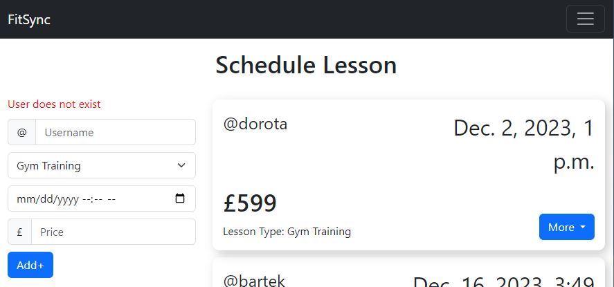

# FitSync

FitSync is a Full-Stack online application created for personal trainers to keep track of their students and schedule lessons with ease so that the students can check when their next lesson will take place. The website allows to create lessons for the user of choice that include the date, time and price. Each created lesson then can be edited or cancelled by the trainer and viewed by the following student.

I created this full-stack website using Django framework, Python, HTML/CSS Bootstrap and JavaScript. I used ElephantSQL as the database of choice to store the usernames and the Scheduled Lessons.

## Table of Contents

* [User Interface / User Experience](#user-interface--user-experience)
* [Design](#design)
* [Features](#features)
* [Database Design](#database-design)
* [Technologies Used](#technologies-used)
* [Credits](#credits)

## User Interface / User Experience

While creating the website I decided to utilize Bootstrap 5 to create a responsive website for mobile and desktop users that has a very clean and professional layout. The website should have content the User can read before signing up to the service so they know if this application suits them. Users of all ages should be able to navigate through the website because each trainer might have different type of students this is very important.

####    Target client for the Website:

-   Based in the UK
-   Personal Trainer
-   Has Existing Clients
-   Individual

## User Stories

###    Web Navigation and Introduction
-   #1 As a user it should be obvious that the website is made for people that are interested in the gym.
-   #2 As a user I can see cards where I can read about what the website goals are and the features that are offered.
-   #3 As a user I can easily navigate to the sign up and login page.
-   ####    Trainer
    -   #4 As a Personal trainer I can easily create a "Trainer Account" by selecting the "Create a Trainer Account:" when signing up, so I am able to book lessons for my students.

###    User Registration and Authentication
-   #5 As a user I can easily register by creating a username, password and selecting what type of account I would like to create.
-   #6 As a user I can easily log out by clicking the "Log Out" button which is placed in the navbar.

###     Dashboard
-   ####    Student
    -   #7 As a user I can easily view the calendar to see what lessons have been created under my username.
    -   #8 I can easily accept or cancel any incoming lessons created by my trainer which will then change its status to cancelled.
-   ####    Trainer
    -   #9 As a trainer I can easily see the lessons I created with the username and date displayed, or there is a message shown when I have none saying "No Lessons Found".
    -   #10 As a trainer I can easily navigate to the scheduling page if there is a need to create a new lesson for a student.

###     Scheduling
-   ####    Trainer
    - #11 As a trainer I can create a lesson by entering the Students username, type of lesson, timestamp and price.
    - #12 As a trainer I can view the lessons with all the details displayed in chronological order.
    - #13 As a trainer I can seamlessly edit and delete each lesson by clicking the "more" button and then pressing the desired option.

## Idea and Plan

The idea for this project came to when I was looking for a business idea to create within a online application that could be used commercially and all over the world without any constraints. As I am familiar with the gym I looked for a personal trainer in my area but it was very difficult to do so and ended up not finding anything at all due to no information on the matter.

My plan was to create an application with tools that Personal Trainers can use to schedule lessons, create workout plans and much more. I would first create great tools that would attract new trainers to sign up for a trainers account, then add a feature that would make finding these trainers easy by people that are seeking personal training in their area.

I asked a few personal trainers online what type of features they would like to see in the application and these are the results from most important to least:

-   Scheduling System
-   Online Workout Programming
-   Virtual Training(P2P)
-   Payments
-   Late Fees

### Agile

For this project I decided to use GitHub's issues tab and list all the challenges a trainer or user faces and give solutions under each one. Using the Agile methodology I planned out how I would tackle each issue and after developing the feature, I would assess if this feature is functional and addresses the issue correctly. If I was unhappy with the feature I would see that something is missing develop an additional solution to the feature.

##  Design

### Wireframes

I sketch my ideas of how the layout of the pages would look using moqups.com, so that I have a design that I can develop off of. Some changes might have been implemented due to finding a better way of displaying the information or due to adding an extra feature:

Home Page

Dashboard for Trainers

Dashboard for Students

Scheduling for Trainers

 

As I used the mobile first approach I also designed wireframes of what these pages would look like on a smaller device. I wanted to keep the design simple to not clatter the screen and make it difficult to follow or read:

Home Page

Dashboard for Trainers

Dashboard for Students

Scheduling for Trainers

 

Every feature that has been added, targets one or potentially more user stories in order to solve the problem of the user. While planning the layout I made sure each feature has a similar design that looks familiar, which improves the ease of navigating through out the website.

## Features

### Navigation
-   #### Navigation Bar
    There are a few type of navigation bars implemented for visiting users and logged in users, furthermore, there is a different navigation bar for the dashboard features that differs for students and trainers. For mobile users the nav bar becomes a hamburger that reveals the options when pressed.

    

Navigation bar for home pages ( Logged Out )

    #
    

    

Navigation bar for home pages ( Logged In )

    
    

    

Navigation bar for home pages ( Mobile )

    
    

     
    The dashboard visually look the same, the only difference between the two is the the list og pages inside the hamburger that appears from the right when pressed:
    

Navigation bar for Dashboard ( Trainer Account ) - Dashboard, scheduling, homepage, log out

    
    

    

Navigation bar for Dashboard ( Student Account ) - Dashboard, homepage, log out

    
    

### User Registration and Authentication

-   #### Sign up
    The website contains the Sign up page where the user is required to create a new username and a password, then the user need to make the choice if he wants to create a student account by default or select the checkbox and create a trainer account.

    

Sign up page

    
    

     

    The sign up form also performs checks in the backend if the username already exists, the passwords is too weak or similar to the username or if the password is not correctly re-typed.

    

Sign up page form error messages

    
    

     

-   #### log In
    The log-in page visually shares a lot of similarities with the sign up page, this is done to make the pages more familiar to the user. The log-in page is kept clean and labeled to improve the accessibility and improves the SEO of the page.

    

Log In page

    
    

     

    The log-in page also returns an error message if the entered username or password is incorrect:
    

Log In page error messages

    
    

     

    If an already logged in user tries to enter the log-in page they will be automatically redirected to the dashboard, the same happens for people that are logging in. When the user wants to log out they can do so by clicking the "log out" button which is placed in either the homepage nav bar or the dashboard navigation bar.

### Dashboard

The backend code check if the logged in user is a "student account" or a "trainer account" and redirects each user accordingly to the pages with the correct permissions assigned to the account type. Explained below:

-   __Student Dashboard__
    
    The student dashboard consist of two elements/features which are, the calendar where the student can see their upcoming lessons and the second feature is the container where the user can accept or cancel any incoming lessons created by the trainer under their username.

    

Student Dashboard

    
    

     

    This account type is forbidden from scheduling lessons for other usernames, if this account type tries to access the scheduling page they will be automatically redirected back to the designated dashboard.

-   __Trainer Dashboard__
    
    The trainer dashboard consists of three elements/features which are, the calendar where the trainer can see upcoming lessons which they created(from earliest to lates). The second feature is the earnings container which displays the amount of money that will be earned from all the lessons added up before and after fees. Lastly, there is a tab added with all the features accessible by the trainer account type and any features that will be available in the future.

    

Trainer Dashboard

    
    

     

### Scheduling

The scheduling dashboard is split into the submit form and a container that displays all the active lessons that have been created. The form requires the trainer to enter the students username, type of lesson, date of the lesson and finally the price. If the username entered into the form doesn't exist, it will return an error message saying "User does not exist".

Schedule Page

Schedule error messages

 

Each lesson displayed has a "more" button when pressed drops down two options which are "Edit" and "delete". 

#### Edit
-   When you press the "edit" option you will be redirected to a form where you can manipulate and edit the information to the lesson of choice. Once you edited the lesson accordingly, all you need to do is hit the "save" button and the lesson will be saved.

Edit Lesson Page

#### Delete
-   When you hit the "delete" option, the lesson of choice will be automatically deleted for the trainer and for the student.

## Database Design

## Technologies Used

### Programming languages
-   HTML/CSS
-   Python
-   JavaScript

### Frameworks
-   __Djnago__ - I used the django framework which uses python to handle all the backend code.
-   __Bootstrap 5__ - I used bootstrap as it offers easy professional styling for web pages and includes mobile responsiveness.

### Extra Libraries or Services
-   __allauth__ - This is a django library that handles user input like signing up or login into the website.
-   __psycopg2__ - this library helps django connect with the elepthantSQL database.
-   __dj-database__ - Makes managing databases very simple.
-   __gunicorn__ - this is a WSGI HTTP server that was used.
-   __Git/github__ - I used these services to version control the project and write out all the user stories out in the issues tab.
##  Credits

Codemy.com
https://animated-gradient-background-generator.netlify.app/